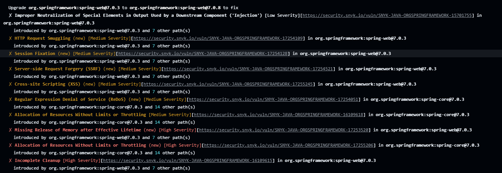
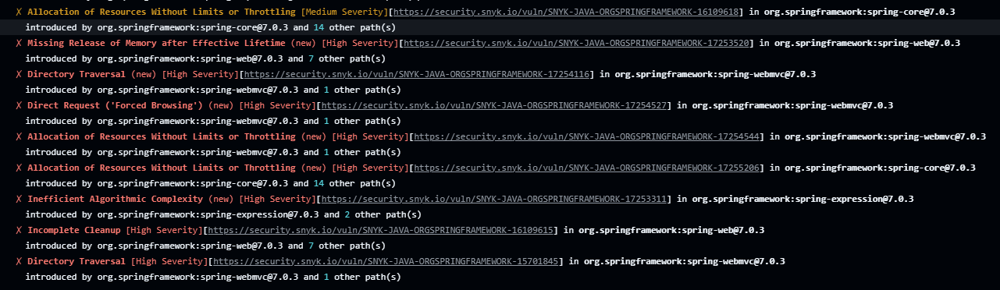
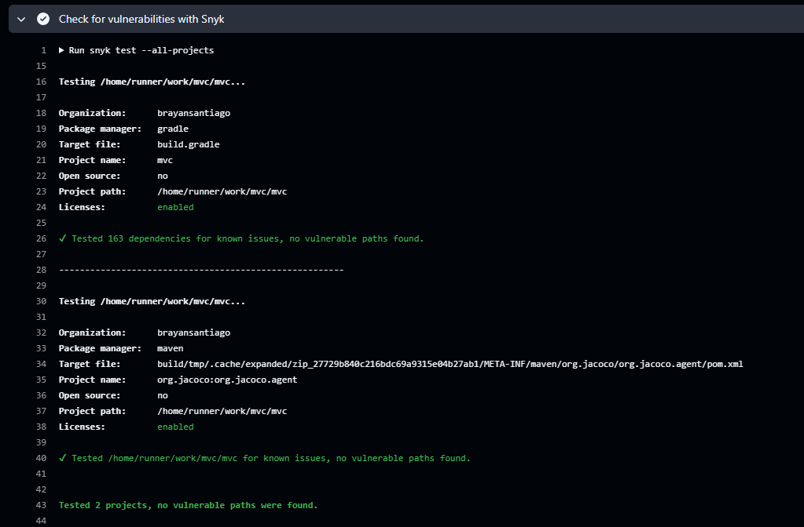
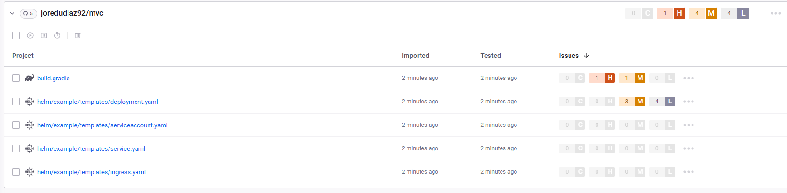

# 📦 Spring Boot MVC & H2 Showcase

Este proyecto es una demostración práctica del patrón arquitectónico **MVC (Modelo-Vista-Controlador)** utilizando **Spring Boot**, **JPA/Hibernate**, y una base de datos **H2** en memoria.

El objetivo principal es demostrar que la "Vista" en MVC no se limita a una interfaz gráfica (HTML), sino que es la **representación de los datos** solicitados, ya sea para consumo humano (HTML) o de máquina (JSON).

## 🚀 Arquitectura del Proyecto

El proyecto implementa los tres pilares del patrón:

1.  **Modelo (`Model`):** Representado por la entidad `Item.java` y su repositorio. Define la estructura de los datos y las reglas de negocio.
2.  **Controlador (`Controller`):** El `ItemController.java` gestiona el flujo de entrada. Recibe las peticiones, consulta al modelo y decide qué "Vista" entregar.
3.  **Vista (`View`):**
    *   **Thymeleaf:** Genera un HTML estilizado con Bootstrap para usuarios finales.
    *   **JSON:** A través de la serialización de Jackson, se entrega una representación cruda de los datos para APIs.

### 💡 El concepto de la "Vista Invisible"
En este proyecto, cuando retornas un **JSON**, estás entregando una Vista. Aunque no pase por un motor de plantillas visual como Thymeleaf, el JSON es la representación formal del Modelo para un cliente (como React, una App móvil o Postman). El **Controller** sigue cumpliendo su rol de desacoplar los datos de su representación final.

## 🛠️ Tecnologías utilizadas

*   **Java 17+**
*   **Spring Boot 3.x**
*   **Spring Data JPA**: Para la persistencia.
*   **H2 Database**: Base de datos SQL en memoria.
*   **Thymeleaf**: Motor de plantillas para la vista HTML.
*   **Bootstrap 5**: Estilizado minimalista y "fino" de la interfaz.
*   **Gradle**: Gestor de dependencias.

## ⚙️ Configuración e Instalación

1.  **Clonar el repositorio:**
    ```bash
    git clone https://github.com
    ```
2.  **Base de Datos:**
    Al arrancar la aplicación, Hibernate crea la estructura basándose en los modelos y ejecuta automáticamente el archivo `src/main/resources/import.sql`, el cual inserta **50 productos de prueba**.
3.  **Ejecutar la aplicación:**
    ```bash
    ./gradlew bootRun
    ```

## 📍 Endpoints y Parámetros

El controlador está configurado para alternar entre tipos de vista mediante un **Query Parameter**:

| URL | Formato de Vista | Descripción |
| :--- | :--- | :--- |
| `http://localhost:8080/items` | **HTML** | Vista clásica con tabla minimalista (por defecto). |
| `http://localhost:8080/items?format=json` | **JSON** | Vista de datos crudos para integración con APIs. |

## 📁 Estructura de Archivos Clave

*   `src/main/java/.../ItemController.java`: El cerebro que decide qué vista renderizar.
*   `src/main/resources/import.sql`: Script de inicialización con los 50 productos.
*   `src/main/resources/templates/productos.html`: Plantilla minimalista con Bootstrap.

---

## Análisis Estático con SonarQube (SonarCloud)

Se integró SonarCloud para realizar análisis estático continuo del código fuente. Esto nos permite asegurar la calidad del código, mantener buenas prácticas y detectar code smells, bugs o problemas antes de integrar el código.

**Evidencia del análisis de SonarCloud:**


---


## Análisis de Vulnerabilidades con Snyk

Se configuró la herramienta Snyk en el pipeline para analizar continuamente las dependencias del proyecto (`build.gradle`) en busca de vulnerabilidades de seguridad conocidas.

Durante la primera ejecución, **Snyk detectó múltiples vulnerabilidades de severidad Alta y Crítica** asociadas principalmente a componentes de Spring, lo cual detuvo intencionalmente la ejecución del pipeline.

**Evidencia de las vulnerabilidades detectadas:**




### Solución aplicada

Para solventar estos riesgos de seguridad de manera óptima, **se actualizó la versión global del framework Spring Boot** en el archivo `build.gradle`, subiendo de la versión `4.0.2` a la versión `4.0.7`. Al realizar esta actualización, el framework trajo automáticamente las versiones parchadas y seguras de todas sus sub-dependencias.

**Evidencia del escaneo limpio tras la actualización:**






---
Creado para fines educativos sobre el patrón MVC en entornos Java modernos.
