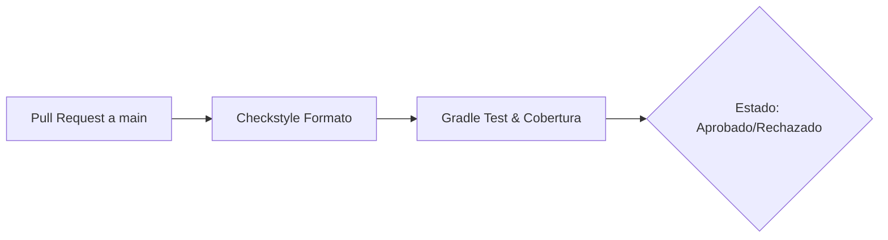
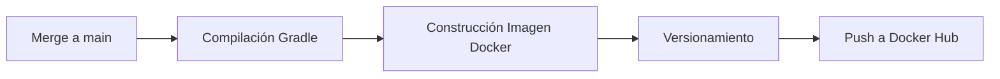
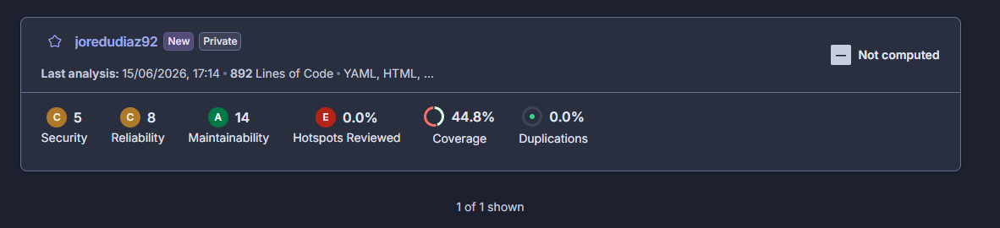
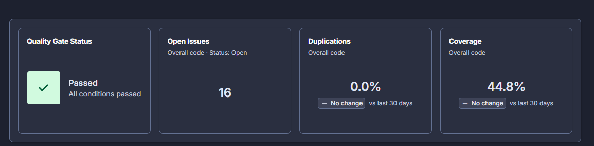

# 📦 Spring Boot MVC & H2 Showcase

Este proyecto es una demostración práctica del patrón arquitectónico **MVC (Modelo-Vista-Controlador)** utilizando **Spring Boot**, **JPA/Hibernate**, y una base de datos **H2** en memoria.

El objetivo principal es demostrar que la "Vista" en MVC no se limita a una interfaz gráfica (HTML), sino que es la **representación de los datos** solicitados, ya sea para consumo humano (HTML) o de máquina (JSON).

## 🚀 Arquitectura del Proyecto

El proyecto implementa los tres pilares del patrón:

1.  **Modelo (`Model`):** Representado por la entidad `Item.java` y su repositorio. Define la estructura de los datos y las reglas de negocio.
2.  **Controlador (`Controller`):** El `ItemController.java` gestiona el flujo de entrada. Recibe las peticiones, consulta al modelo y decide qué "Vista" entregar.
3.  **Vista (`View`):**
    *   **Thymeleaf:** Genera un HTML estilizado con Bootstrap para usuarios finales.
    *   **JSON:** A través de la serialización de Jackson, se entrega una representación cruda de los datos para APIs.

### 💡 El concepto de la "Vista Invisible"
En este proyecto, cuando retornas un **JSON**, estás entregando una Vista. Aunque no pase por un motor de plantillas visual como Thymeleaf, el JSON es la representación formal del Modelo para un cliente (como React, una App móvil o Postman). El **Controller** sigue cumpliendo su rol de desacoplar los datos de su representación final.

## 🛠️ Tecnologías utilizadas

*   **Java 17+**
*   **Spring Boot 3.x**
*   **Spring Data JPA**: Para la persistencia.
*   **H2 Database**: Base de datos SQL en memoria.
*   **Thymeleaf**: Motor de plantillas para la vista HTML.
*   **Bootstrap 5**: Estilizado minimalista y "fino" de la interfaz.
*   **Gradle**: Gestor de dependencias.

## ⚙️ Configuración e Instalación

1.  **Clonar el repositorio:**
    ```bash
    git clone https://github.com
    ```
2.  **Base de Datos:**
    Al arrancar la aplicación, Hibernate crea la estructura basándose en los modelos y ejecuta automáticamente el archivo `src/main/resources/import.sql`, el cual inserta **50 productos de prueba**.
3.  **Ejecutar la aplicación:**
    ```bash
    ./gradlew bootRun
    ```

## 📍 Endpoints y Parámetros

El controlador está configurado para alternar entre tipos de vista mediante un **Query Parameter**:

| URL | Formato de Vista | Descripción |
| :--- | :--- | :--- |
| `http://localhost:8080/items` | **HTML** | Vista clásica con tabla minimalista (por defecto). |
| `http://localhost:8080/items?format=json` | **JSON** | Vista de datos crudos para integración con APIs. |

## 📁 Estructura de Archivos Clave

*   `src/main/java/.../ItemController.java`: El cerebro que decide qué vista renderizar.
*   `src/main/resources/import.sql`: Script de inicialización con los 50 productos.
*   `src/main/resources/templates/productos.html`: Plantilla minimalista con Bootstrap.

---

## Justificación de las Herramientas Utilizadas

| Herramienta | Rol en la Arquitectura | Propósito y Beneficio Clave |
| :--- | :--- | :--- |
| **Docker** | Contenedores | Proporciona un entorno estandarizado para aislar la aplicación de la infraestructura subyacente. |
| **Minikube** | Clúster Local | Actúa como el entorno de pruebas local ideal para simular un clúster de Kubernetes real, validando configuraciones de orquestación antes de ir a producción. |
| **ArgoCD** | GitOps | Automatiza los despliegues sincronizando el estado del clúster de Kubernetes con los manifiestos del repositorio de Git, eliminando intervenciones manuales y reduciendo errores humanos. |
| **JMeter** | Pruebas de Carga | Valida la resiliencia del sistema generando cargas masivas de tráfico simétrico para someterlo a condiciones extremas de estrés y detectar cuellos de botella. |
| **Prometheus** | Monitoreo | Centraliza la observabilidad recolectando en tiempo real las métricas de rendimiento y salud del clúster. |
| **Grafana** | Visualización | Transforma las métricas recolectadas por Prometheus en páneles visuales e interpretables para una toma de decisiones informada. |
| **Helm** | Gestor de Paquetes | Simplifica la gestión de empaquetado, permitiendo desplegar y versionar arquitecturas complejas de Kubernetes (como la pila de Prometheus y Grafana) mediante plantillas reutilizables. |

### A. Evidencia de Seguridad y Monitoreo
* **Seguridad:** Se garantiza mediante el aislamiento perimetral en Docker y Kubernetes, limitando estrictamente el radio de exposición de los servicios.
* **Monitoreo y Resiliencia:** Se validó mediante una prueba de estrés de **200,000 peticiones en 10 minutos** ejecutada con JMeter. El panel de Grafana registró simultáneamente el comportamiento del consumo de memoria RAM y CPU, sirviendo como evidencia de que el sistema puede autorregularse, escalar y mantener la disponibilidad bajo cargas masivas.

### B. Reflexión sobre Eficiencia Operativa
La combinación de una tubería CI/CD automatizada con despliegues basados en GitOps (ArgoCD) optimiza drásticamente el **Time-to-Market**. Los desarrolladores solo deben enviar (`push`) código al repositorio; las herramientas se encargan de validar, empaquetar y desplegar de forma transparente. Esto:
* Reduce los tiempos muertos operativos.
* Permite recuperaciones instantáneas ante fallos (*rollbacks*).
* Libera al equipo de ingeniería de tareas manuales repetitivas.

---

## Análisis Detallado de los Workflows (`.github/workflows`)

Basado en las convenciones estándar de automatización para proyectos Java modernos con Spring Boot y contenedores, este es el desglose técnico de los procesos:

### Tubería 1: Integración Continua (`ci.yml`)



* **¿Qué hace?** Valida la calidad, formato y lógica del código fuente de manera automática cada vez que un desarrollador propone cambios a la rama principal.
* **¿Cómo lo hace?** 
  1. Se activa únicamente ante eventos de *Pull Request* dirigidos a la rama `main`.
  2. Descarga el código del repositorio e instala el entorno de ejecución (Java 17 o superior).
  3. Ejecuta herramientas de análisis estático como **Checkstyle** para validar el cumplimiento de las reglas de formato de código.
  4. Lanza los tests unitarios e integrados mediante Gradle (`./gradlew test`) y genera un reporte de cobertura de código.
* **¿Por qué se hace?** Para garantizar la estabilidad de la rama principal. Actúa como una aduana automatizada que impide la mezcla (*merge*) de código roto, mal formateado o que no cumpla con los estándares mínimos de pruebas.

### Tubería 2: Despliegue Continuo (`cd.yml`)



* **¿Qué hace?** Automatiza la construcción del artefacto final de software y su empaquetado en un contenedor listo para ser desplegado en el clúster.
* **¿Cómo lo hace?**
  1. Se activa de forma automática inmediatamente después de que un cambio es mezclado (*push/merge*) en la rama `main`.
  2. Compila el proyecto Java y genera el archivo ejecutable (`.jar`) limpio de errores.
  3. Utiliza el archivo `Dockerfile` de la raíz para construir la imagen del contenedor.
  4. Genera de forma dinámica un número de versión único (basado en el ID del commit de Git o un incremento secuencial).
  5. Realiza la autenticación segura en Docker Hub e inyecta la imagen empaquetada en el repositorio público: `joredudiaz92/mvc`.
* **¿Por qué se hace?** Para eliminar el desfase entre el código terminado y el software desplegable. Al publicar la imagen de manera inmediata, se genera el disparador necesario para que **ArgoCD** detecte la actualización y refresque el clúster de Kubernetes en Minikube de forma transparente.

---

## 📦 Recursos del Repositorio

* **Evidencias visuales:** Capturas de pantalla del correcto funcionamiento de todas las herramientas y de las métricas en los paneles de Grafana + Prometheus se encuentran en la carpeta [`/screenshots`](./screenshots).
* **Pruebas de carga:** El archivo de configuración de JMeter (`.jmx`) utilizado para realizar las pruebas de estrés está disponible en la carpeta [`/jmeter`](./jmeter).

## Análisis Estático con SonarQube (SonarCloud)

Se integró SonarCloud para realizar análisis estático continuo del código fuente. Esto nos permite asegurar la calidad del código, mantener buenas prácticas y detectar code smells, bugs o problemas antes de integrar el código.

**Evidencia SonarCloud:**




---


## Análisis de Vulnerabilidades con Snyk

Se configuró la herramienta Snyk en el pipeline para analizar continuamente las dependencias del proyecto (`build.gradle`) en busca de vulnerabilidades de seguridad conocidas.

Durante la primera ejecución, **Snyk detectó múltiples vulnerabilidades de severidad Alta y Crítica** asociadas principalmente a componentes de Spring, lo cual detuvo intencionalmente la ejecución del pipeline.

**Evidencia de las vulnerabilidades detectadas:**


### Solución aplicada

Para solventar estos riesgos de seguridad de manera óptima, **se actualizó la versión global del framework Spring Boot** en el archivo `build.gradle`, subiendo de la versión `4.0.2` a la versión `4.0.7`. Al realizar esta actualización, el framework trajo automáticamente las versiones parchadas y seguras de todas sus sub-dependencias.

**Evidencia del escaneo limpio tras la actualización:**


---
Creado para fines educativos sobre el patrón MVC en entornos Java modernos.
